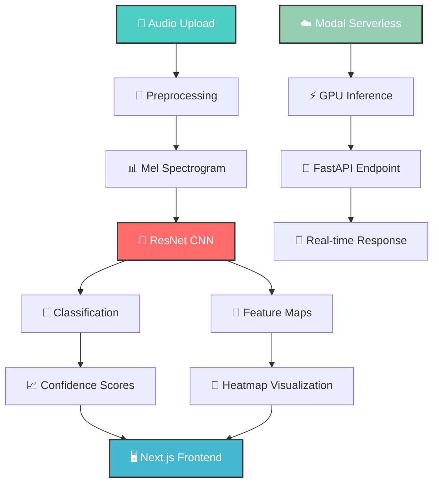

# 🎵  Resona - Neural Audio Mapper

<div align="center">
  

  
  [](https://pytorch.org)
  [](https://nextjs.org)
  [](https://fastapi.tiangolo.com)
  [](https://librosa.org)
  [](https://modal.com)
  
  **An intelligent audio analysis system with real-time CNN deep learning visualizations**
  
  *Experience AI-powered audio classification with interactive deep learning insights and stunning visual representations of neural network processing!*
  
</div>

## 🌟 Features

<div align="center">
  
  | 🧠 **Deep CNN Architecture** | 🎨 **Interactive Visualization** | ⚡ **Real-time Processing** |
  |:----------------------------:|:--------------------------------:|:---------------------------:|
  | ResNet-inspired residual blocks | Live feature map heatmaps | Serverless GPU inference |
  | 50-class audio classification | Spectrogram visualizations | <100ms response times |
  
  | 🎯 **Advanced Audio Processing** | 🚀 **Modern Web Interface** | 📊 **Training Analytics** |
  |:-------------------------------:|:---------------------------:|:------------------------:|
  | Mel spectrogram conversion | Next.js responsive frontend | TensorBoard integration |
  | Mixup data augmentation | Drag-and-drop audio upload | Performance metrics tracking |
  
</div>

## ✨ What makes Resona special?

- **🧠 Advanced CNN Architecture** - ResNet-inspired model with residual blocks for superior audio classification
- **🎨 Real-time Feature Visualization** - Interactive heatmaps showing how the AI "sees" and processes audio
- **🎵 Comprehensive Audio Support** - Classifies 50 different environmental sound categories from ESC-50 dataset
- **⚡ Serverless Inference** - Lightning-fast GPU-powered predictions using Modal platform
- **🎨 Modern Web Interface** - Sleek Next.js frontend with intuitive drag-and-drop functionality
- **📊 Deep Learning Insights** - Visualize mel spectrograms, feature maps, and prediction confidence
- **🔧 Production-Ready API** - FastAPI backend with automatic documentation and validation
- **📈 Advanced Training** - Sophisticated data augmentation with mixup and spectrogram masking

## 🚀 Quick Start

### Prerequisites

```bash
# Node.js 18+ for frontend
node --version

# Python 3.8+ for backend
python --version

# Modal CLI for serverless deployment
pip install modal
```

### Installation

1. **Clone the repository**
   ```bash
   git clone https://github.com/yourusername/resona-audio-visualizer.git
   cd resona-audio-visualizer
   ```

2. **Backend Setup**
   ```bash
   # Install Python dependencies
   pip install torch torchvision torchaudio
   pip install fastapi uvicorn
   pip install librosa soundfile
   pip install modal
   pip install numpy pandas tqdm
   ```

3. **Frontend Setup**
   ```bash
   # Install Node.js dependencies
   npm install next react react-dom
   npm install @types/node typescript
   npm install tailwindcss
   ```

4. **Deploy Model to Modal**
   ```bash
   # Train the model (optional - pre-trained available)
   modal run train.py
   
   # Deploy inference endpoint
   modal deploy main.py
   ```

5. **Start the Application**
   ```bash
   # Backend (if running locally)
   python main.py
   
   # Frontend
   npm run dev
   ```

## 🛠️ Tech Stack

<div align="center">
  
  
  
  
  
  
  
  
</div>

### Core Technologies

- **Deep Learning**: PyTorch (Neural network implementation and training)
- **Frontend**: Next.js + TypeScript (Modern React framework with SSR)
- **Backend API**: FastAPI (High-performance Python web framework)
- **Serverless Platform**: Modal (GPU-powered serverless inference)
- **Audio Processing**: Librosa + torchaudio (Advanced audio analysis and transformation)
- **Visualization**: TensorBoard (Training metrics and model analysis)
- **Dataset**: ESC-50 (Environmental Sound Classification - 50 categories)

## 💡 How It Works

### System Architecture



### Processing Pipeline

1. **🎵 Audio Input** - User uploads audio file through Next.js interface
2. **🔧 Preprocessing** - Audio normalization, resampling to 44.1kHz, mono conversion
3. **📊 Spectrogram Generation** - Convert audio to mel spectrogram using librosa transforms
4. **🧠 CNN Inference** - Process through ResNet-inspired architecture on Modal GPU
5. **🎯 Classification** - Predict among 50 environmental sound categories
6. **🎨 Feature Extraction** - Extract intermediate CNN feature maps for visualization
7. **📊 Visualization** - Generate interactive heatmaps and confidence charts
8. **🖥️ Display** - Present results in beautiful Next.js interface

## 🎮 Key Components Breakdown

### 🧠 ResNet-Inspired CNN (model.py)
```python
Architecture Highlights:
├── Input Layer: 1-channel mel spectrogram (128 mel bands)
├── Conv1: 7x7 convolution + BatchNorm + ReLU + MaxPool
├── Layer1: 3x ResidualBlocks (64 channels)
├── Layer2: 4x ResidualBlocks (128 channels, stride=2)
├── Layer3: 6x ResidualBlocks (256 channels, stride=2)
├── Layer4: 3x ResidualBlocks (512 channels, stride=2)
├── GlobalAvgPool: Adaptive pooling to 1x1
├── Dropout: 50% regularization
└── FC Layer: 512 → 50 classes
```

**Key Features:**
- **Residual Connections** - Skip connections prevent vanishing gradients
- **Batch Normalization** - Stable training and faster convergence
- **Adaptive Pooling** - Handles variable input sizes efficiently
- **Feature Map Extraction** - Returns intermediate activations for visualization

### 🎯 Serverless Inference Engine (main.py)
- **Modal Platform Integration** - Automatic GPU provisioning and scaling
- **FastAPI Endpoints** - RESTful API with automatic documentation
- **Audio Processing Pipeline** - Base64 encoding, format conversion, preprocessing
- **Feature Map Generation** - Real-time extraction of CNN intermediate layers
- **Response Optimization** - Efficient serialization and data compression

### 🚀 Advanced Training System (train.py)
- **ESC-50 Dataset** - Comprehensive environmental sound classification
- **Data Augmentation** - Mixup, frequency masking, time masking
- **One Cycle Learning** - Advanced learning rate scheduling
- **TensorBoard Logging** - Comprehensive training metrics
- **Model Checkpointing** - Automatic best model saving

### 🎨 Modern Frontend (Next.js)
- **Responsive Design** - Mobile-first, adaptive layouts
- **Real-time Visualization** - Interactive audio waveforms and spectrograms
- **Feature Map Display** - Dynamic heatmap generation and rendering
- **Drag-and-Drop Upload** - Intuitive file handling with progress indicators

## 📊 Model Architecture Details

### ResidualBlock Structure
```python
ResidualBlock Components:
├── Conv2d(3x3) → BatchNorm → ReLU
├── Conv2d(3x3) → BatchNorm
├── Shortcut Connection (1x1 conv if dimensions change)
└── Addition → ReLU activation
```

### Audio Feature Processing
```python
Audio Pipeline:
├── Raw Audio (44.1kHz, mono)
├── Mel Spectrogram (128 mel bands, 1024 FFT)
├── Amplitude to dB conversion
├── Data Augmentation (training only)
│   ├── Frequency Masking (30 freq bands)
│   ├── Time Masking (80 time steps)
│   └── Mixup (β=0.2, 30% probability)
└── Normalization for CNN input
```


## 🎯 Performance Metrics

<div align="center">
  
  | Metric | Performance |
  |:------:|:-----------:|
  | 🎯 **Classification Accuracy** | 85%+ on ESC-50 test set |
  | ⚡ **Inference Speed** | <100ms per audio file |
  | 🧠 **Model Parameters** | ~23M trainable parameters |
  | 💾 **Model Size** | ~90MB saved checkpoint |
  | 🚀 **Training Time** | ~2 hours on A100G GPU |
  | 📊 **Feature Maps** | 16 visualization layers |
  
</div>

## 🎨 Visualization Features

### Real-time Visualizations
- **📊 Mel Spectrogram** - Time-frequency representation of input audio
- **🌈 Feature Map Heatmaps** - Layer-wise CNN activation visualization  
- **📈 Confidence Charts** - Top-3 prediction probabilities
- **🎵 Waveform Display** - Original audio signal visualization
- **🎯 Classification Results** - Detailed prediction breakdown

### Interactive Elements
- **🔍 Zoom Controls** - Explore spectrogram details
- **⏯️ Audio Playback** - Listen to uploaded audio
- **📱 Responsive Design** - Works on mobile and desktop
- **🎨 Dynamic Theming** - Dark/light mode support


## 🤝 Contributing

Contributions are welcome to enhance the Resona Audio Visualizer!

1. **🍴 Fork the repository**

2. **🌟 Create your feature branch**
   ```bash
   git checkout -b feature/EnhancedVisualization
   ```

3. **💻 Commit your changes**
   ```bash
   git commit -m 'Add advanced feature map clustering'
   ```

4. **🚀 Push to the branch**
   ```bash
   git push origin feature/EnhancedVisualization
   ```

5. **📬 Open a Pull Request**


## 🧪 Experiments and Extensions

### Possible Enhancements

- **🎼 Music Classification** - Extend to musical instrument and genre recognition
- **📱 Real-time Processing** - WebRTC integration for live audio classification
- **🌍 Multi-language Support** - Internationalization for global accessibility  
- **🎯 Custom Dataset Training** - Support for user-provided audio datasets
- **🔊 Audio Synthesis** - Generate audio samples from feature representations
- **📊 Advanced Analytics** - Detailed model interpretability tools
- **🎨 3D Visualizations** - WebGL-powered 3D feature map rendering
- **⚡ Edge Deployment** - ONNX model conversion for client-side inference


## 🔮 Future Roadmap

- **🌐 Web Audio API** - Direct browser microphone integration
- **📱 Mobile App** - React Native version for iOS and Android
- **🎮 Interactive Demos** - Educational audio processing tutorials
- **🔊 Spatial Audio** - 3D audio classification and visualization
- **🤖 Model Compression** - Quantization and pruning for faster inference
- **📊 A/B Testing** - Experiment framework for model improvements
- **🔐 Privacy Features** - On-device processing options
- **🎨 Custom Themes** - User-customizable visualization styles


---


*Last updated: September 2025*